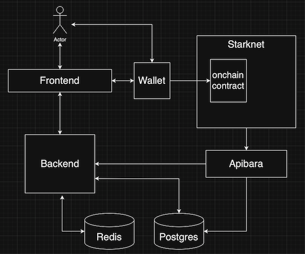

<div align="center">
  

  ***Collaborative art canvas on Starknet***

  [](https://github.com/keep-starknet-strange/art-peace/actions/workflows/check.yml)
  [](https://github.com/keep-starknet-strange/art-peace/actions/workflows/build.yml)

  [![Exploration_Team](https://img.shields.io/badge/Exploration_Team-29296E.svg?&style=for-the-badge&logo=data:image/svg%2bxml;base64,PD94bWwgdmVyc2lvbj0iMS4wIiBlbmNvZGluZz0iVVRGLTgiPz48c3ZnIGlkPSJhIiB4bWxucz0iaHR0cDovL3d3dy53My5vcmcvMjAwMC9zdmciIHZpZXdCb3g9IjAgMCAxODEgMTgxIj48ZGVmcz48c3R5bGU+LmJ7ZmlsbDojZmZmO308L3N0eWxlPjwvZGVmcz48cGF0aCBjbGFzcz0iYiIgZD0iTTE3Ni43Niw4OC4xOGwtMzYtMzcuNDNjLTEuMzMtMS40OC0zLjQxLTIuMDQtNS4zMS0xLjQybC0xMC42MiwyLjk4LTEyLjk1LDMuNjNoLjc4YzUuMTQtNC41Nyw5LjktOS41NSwxNC4yNS0xNC44OSwxLjY4LTEuNjgsMS44MS0yLjcyLDAtNC4yN0w5Mi40NSwuNzZxLTEuOTQtMS4wNC00LjAxLC4xM2MtMTIuMDQsMTIuNDMtMjMuODMsMjQuNzQtMzYsMzcuNjktMS4yLDEuNDUtMS41LDMuNDQtLjc4LDUuMThsNC4yNywxNi41OGMwLDIuNzIsMS40Miw1LjU3LDIuMDcsOC4yOS00LjczLTUuNjEtOS43NC0xMC45Ny0xNS4wMi0xNi4wNi0xLjY4LTEuODEtMi41OS0xLjgxLTQuNCwwTDQuMzksODguMDVjLTEuNjgsMi4zMy0xLjgxLDIuMzMsMCw0LjUzbDM1Ljg3LDM3LjNjMS4zNiwxLjUzLDMuNSwyLjEsNS40NCwxLjQybDExLjQtMy4xMSwxMi45NS0zLjYzdi45MWMtNS4yOSw0LjE3LTEwLjIyLDguNzYtMTQuNzYsMTMuNzNxLTMuNjMsMi45OC0uNzgsNS4zMWwzMy40MSwzNC44NGMyLjIsMi4yLDIuOTgsMi4yLDUuMTgsMGwzNS40OC0zNy4xN2MxLjU5LTEuMzgsMi4xNi0zLjYsMS40Mi01LjU3LTEuNjgtNi4wOS0zLjI0LTEyLjMtNC43OS0xOC4zOS0uNzQtMi4yNy0xLjIyLTQuNjItMS40Mi02Ljk5LDQuMyw1LjkzLDkuMDcsMTEuNTIsMTQuMjUsMTYuNzEsMS42OCwxLjY4LDIuNzIsMS42OCw0LjQsMGwzNC4zMi0zNS43NHExLjU1LTEuODEsMC00LjAxWm0tNzIuMjYsMTUuMTVjLTMuMTEtLjc4LTYuMDktMS41NS05LjE5LTIuNTktMS43OC0uMzQtMy42MSwuMy00Ljc5LDEuNjhsLTEyLjk1LDEzLjg2Yy0uNzYsLjg1LTEuNDUsMS43Ni0yLjA3LDIuNzJoLS42NWMxLjMtNS4zMSwyLjcyLTEwLjYyLDQuMDEtMTUuOGwxLjY4LTYuNzNjLjg0LTIuMTgsLjE1LTQuNjUtMS42OC02LjA5bC0xMi45NS0xNC4xMmMtLjY0LS40NS0xLjE0LTEuMDgtMS40Mi0xLjgxbDE5LjA0LDUuMTgsMi41OSwuNzhjMi4wNCwuNzYsNC4zMywuMTQsNS43LTEuNTVsMTIuOTUtMTQuMzhzLjc4LTEuMDQsMS42OC0xLjE3Yy0xLjgxLDYuNi0yLjk4LDE0LjEyLTUuNDQsMjAuNDYtMS4wOCwyLjk2LS4wOCw2LjI4LDIuNDYsOC4xNiw0LjI3LDQuMTQsOC4yOSw4LjU1LDEyLjk1LDEyLjk1LDAsMCwxLjMsLjkxLDEuNDIsMi4wN2wtMTMuMzQtMy42M1oiLz48L3N2Zz4=)](https://github.com/keep-starknet-strange)

</div>

## Overview

`art/peace` is a collaborative art game where users can place pixels on a large shared canvas and receive rewards for collaborating to build art. The game will run over X days, and end with a final snapshot of the board. The goal is to give users the feeling of collectively building on a highly responsive art canvas, which they can explore, interact with, and compete on.

Some of the features include :

- **Placing Pixels** : This will be the main user interaction, where every X minutes a user will be allowed to place a pixel onto the canvas.
- **Quests** : Tasks to get extra pixels to place on-top of the one every X minutes.
- **Voting** : In addition to the base colors, there will be a vote to add new colors to the palette every day.
- **Templates** : Artwork templates used to help communities collaborate on an art piece. Bounties can be added to a template to incentivize creation.
- **NFTs** : Mint NFTs from the canvas.

## Running

TODO: Note build and run for each modules

#### Docker ( Recommended )
```
docker compose up
```

To stop the run use `Ctrl-C`.

For a complete reset of the state and rebuild of the containers use :
```
# WARNING! This will clear the state (volumes) of all the DBs and the Devnet
docker compose down --volumes
docker compose build
```

#### Local
```
# Must install all the dependencies first
# Change the user on `configs/database.config.json` for postgres
make integration-test-local
```

To stop the run use `Ctrl-C`.

## Build

TODO: Note build and run for each modules
#### Docker ( Recommended )
```
docker compose build
```

#### Local
Use the `make X-build` command for each corresponding module `X`. See the **Modules** section below for more details.

## Modules

- **Onchain:** [Starknet contract(s)](./onchain/) for trustless onchain interactions.
- **Backend:** [Monolithic Go backend](./backend/) for managing requests, interactions, and DBs.
- **Frontend:** [Reactjs application](./frontend/) for users to interact with.
- **Indexer:** [Apibara indexer](./indexer/) for monitoring Starknet events and forwarding to the DBs.
- **Postgres:** DB for storing general data used for analytics, frontend, and backend.
- **Redis:** In memory DB used to store the compressed `Canvas` data for fast retrieval
- **tests:** Integration tests for local, docker, ...



## Dependencies

Its recommended to use `docker compose` when building and running, so the only dependencies would be [docker](https://docs.docker.com/desktop/) and [docker compose](https://docs.docker.com/compose/install/linux/)

Howeveer, it might be worth running only certain modules for development/testing sometimes. Each module has various dependencies, check [dependencies.txt](./dependencies.txt) for more details.

## References

- [Diagrams](./docs/diagrams/)
- [r/place technical document](https://www.redditinc.com/blog/how-we-built-rplace)

## Contributors ✨

Thanks goes to these wonderful people. Follow the [contributors guide](https://github.com/keep-starknet-strange/art-peace/blob/main/CONTRIBUTING.md) if you'd like to take part.

<!-- ALL-CONTRIBUTORS-LIST:START - Do not remove or modify this section -->
<!-- prettier-ignore-start -->
<!-- markdownlint-disable -->
<table>
  <tbody>
    <tr>
      <td align="center" valign="top" width="14.28%"><a href="https://github.com/b-j-roberts"><br /><sub><b>Brandon R</b></sub></a><br /><a href="https://github.com/keep-starknet-strange/art-peace/commits?author=b-j-roberts" title="Code">💻</a></td>
    </tr>
  </tbody>
  <tfoot>
    <tr>
      <td align="center" size="13px" colspan="7">
        
          <a href="https://all-contributors.js.org/docs/en/bot/usage">Add your contributions</a>
        </img>
      </td>
    </tr>
  </tfoot>
</table>

<!-- markdownlint-restore -->
<!-- prettier-ignore-end -->

<!-- ALL-CONTRIBUTORS-LIST:END -->

This project follows the [all-contributors](https://github.com/all-contributors/all-contributors) specification. Contributions of any kind welcome!
