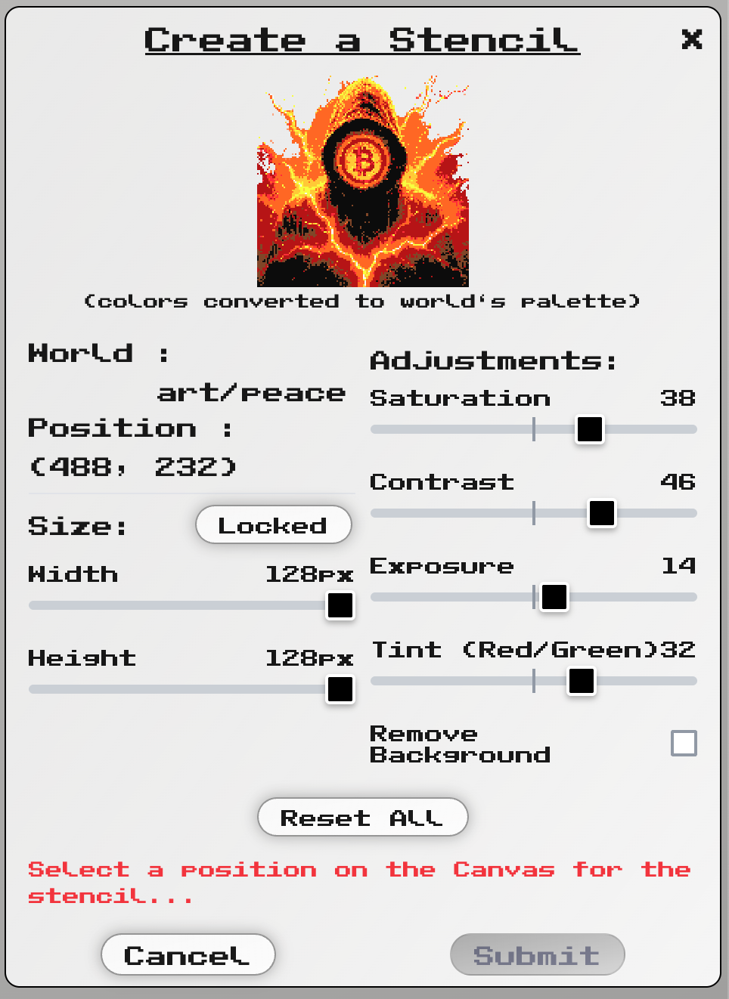

# Version 1.3: Better Stencils

## Release Date: August 2025

## Overview
This release brings significant improvements to the stencil creation system, introducing advanced image processing capabilities, enhanced UI/UX, and developer-friendly features for testing stencil functionality locally.

## New Features

### 🎨 Advanced Image Processing
- **Multiple Format Support**: Upload stencils in PNG, JPEG, JPG, or WebP formats
- **Large Image Support**: Handle images up to 5000x5000px with automatic scaling
- **Real-time Image Adjustments**:
  - Saturation control (-100 to +100)
  - Contrast adjustment (-100 to +100)
  - Exposure/brightness control (-100 to +100)
  - Tint/color shift (-100 to +100)
- **Background Removal**: Smart automatic background removal with configurable tolerance
- **Dynamic Size Control**: Adjustable width and height (5-128px) with aspect ratio lock

### 🤖 Stencil Bot Integration
- Quick access bot button on each stencil item
- One-click activation to start placing stencils

### 🛠️ Developer Experience
- **Dev Mode**: Test stencil creation locally without blockchain authentication
- Environment variable configuration for development workflows
- Enhanced CLAUDE.md documentation for AI-assisted development



## UI/UX Improvements

### Two-Column Layout
- Organized stencil creation interface with logical grouping:
  - **Left Column**: World info, position, and size controls
  - **Right Column**: Image adjustments and background removal
- Consistent layout across all screen sizes for predictable experience

### Enhanced Controls
- Visual slider design with:
  - Custom pixel-art aesthetic
  - Clear center indicators for neutral positions
  - Hover effects and visual feedback
  - Horizontal tracks showing adjustment range
- Improved button interactions:
  - Move button for easy position repositioning
  - Reset All button maintains proportional dimensions
  - Larger checkbox for background removal (28px)

### Streamlined Interface
- Reduced visual clutter with optimized spacing
- Removed redundant information displays
- Cleaner upload button text
- Compact section organization with clear visual hierarchy

## Technical Improvements

### Image Processing Pipeline
Optimized processing order for best results:
1. Image Import (multi-format support)
2. Color Effects Application (at original resolution)
3. Image Scaling (to user-defined dimensions)
4. Canvas Color Conversion
5. Background Removal (applied post-conversion for accuracy)

### Performance Enhancements
- Multi-canvas approach for optimal image processing
- Smart aspect ratio preservation algorithms
- Efficient state management with proper cleanup
- Real-time preview updates without lag

## Configuration

### New Environment Variables
```env
NEXT_PUBLIC_DEV_MODE=true          # Enable dev mode for local testing
NEXT_PUBLIC_UPLOAD_ENABLED=true    # Enable stencil upload feature
```

## Breaking Changes
None - all changes are backward compatible

## Bug Fixes
- Fixed Reset All button to maintain original or proportionally scaled dimensions
- Corrected vertical centering of slider indicators
- Resolved TypeScript errors in stencil creation components

## Migration Notes
No migration required. New features are opt-in and existing functionality remains unchanged.

## Contributors
- Development team
- Claude AI Assistant for code generation and commit messages
