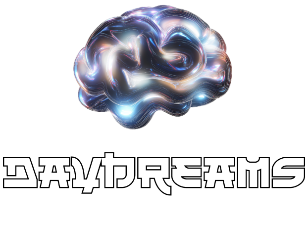
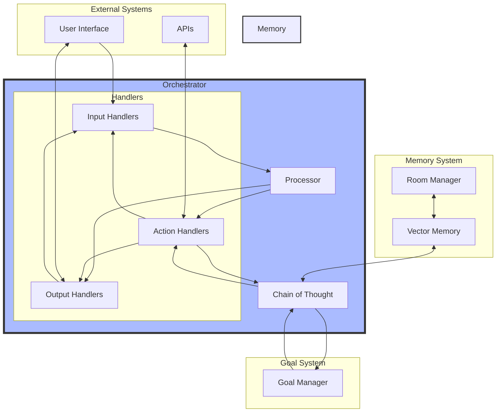

<p align="center">
  
</p>

# Daydreams - for Defai, games and more

Daydreams is a generative agent library for executing anything onchain. It is chain agnostic and can be used to perform onchain tasks - including play any onchain game - by simply injecting context. Base, Solana, Ethereum, Starknet, etc.

It is designed to be as lite as possible while remaining powerful and flexible.

## Table of Contents

- [Quick Start](#quick-start)
- [Examples](#examples)
  - [Basic Example](#basic-example)
  - [Goal-Based Example](#goal-based-example)
  - [Twitter Bot Example](#twitter-bot-example)
  - [API Example](#api-example)
- [How It Works](#how-it-works)
  - [Context](#context)
  - [Actions](#actions)
  - [Goals](#goals)
  - [Monitor Progress](#monitor-progress)
- [Architecture](#architecture)
  - [Core Concepts](#core-concepts)
  - [Protocol Design](#protocol-design)
- [Development](#development)
- [Roadmap](#roadmap)
- [Contributors](#contributors)

## Quick Start

Prerequisites:

- Node.js 18+ using [nvm](https://github.com/nvm-sh/nvm)
- [pnpm](https://pnpm.io/)
- [Bun](https://bun.sh/)
- [Docker Desktop](https://www.docker.com/)

```bash
# Install dependencies
pnpm install

# Copy environment variables
cp .env.example .env

# Start docker services
docker compose up -d
```

## Examples

The project includes several example implementations demonstrating different use cases:

### Basic Example

A simple CLI agent that can execute tasks using Chain of Thought:

```bash
# Run basic example
bun task
```

### Goal-Based Example

Demonstrates hierarchical goal planning and execution:

```bash
# Run goal-based example
bun goal
```

### Twitter Bot Example

A Twitter bot that can monitor mentions and generate autonomous thoughts:

```bash
# Run Twitter bot example
bun twitter
```

### API Example

Shows how to integrate with external APIs:

```bash
# Run API example
bun api
```

## Concepts

Daydreams is built around the following concepts:

- Orchestrator
- Handlers
- Goals
- Memory
- Chain of Thought

### Orchestrator

The Orchestrator is the central component that manages the flow of data through the system. It is responsible for:

- Registering handlers
- Routing data through the system
- Scheduling recurring tasks
- Maintaining the autonomous flow
- Calling the Chain of Thought

### Handlers

Handlers are the building blocks of the system. They are responsible for processing data and producing outputs. They are registered with the Orchestrator and are chained together in an autonomous flow.

Register handlers for inputs, outputs, and actions using `registerIOHandler`. Each handler has a role, description, schema, and handler function:

- **Input Handlers**: Process incoming data (e.g., user messages, API webhooks)
- **Action Handlers**: Execute operations and return results (e.g., API calls, database queries)
- **Output Handlers**: Produce side effects (e.g., sending messages, updating UI)

```typescript
// Register an action handler
orchestrator.registerIOHandler({
  name: "universalApiCall",
  role: "action",
  schema: z.object({
    method: z.enum(["GET", "POST", "PUT", "PATCH", "DELETE"]),
    url: z.string().url(),
    headers: z.record(z.string()).optional(),
    body: z.union([z.string(), z.record(z.any())]).optional(),
  }),
  handler: async (payload) => {
    // Handler implementation
    const response = await fetch(/* ... */);
    return response;
  },
});

// Register an input handler
orchestrator.registerIOHandler({
  name: "user_chat",
  role: "input",
  schema: z.object({
    content: z.string(),
    userId: z.string().optional(),
  }),
  handler: async (payload) => {
    return payload;
  },
});

// Register an output handler
orchestrator.registerIOHandler({
  name: "ui_chat_reply",
  role: "output",
  schema: z.object({
    userId: z.string().optional(),
    message: z.string(),
  }),
  handler: async (payload) => {
    console.log(`Reply to user ${payload.userId}: ${payload.message}`);
  },
});
```

### Goals

The agent uses Chain of Thought processing to:

- Plan strategies for achieving goals
- Break down complex goals into subgoals
- Execute actions to accomplish goals
- Learn from experiences and store knowledge

### Monitor Progress

Subscribe to events to track the agent's thinking and actions:

```typescript
dreams.on("think:start", ({ query }) => {
  console.log("🧠 Starting to think about:", query);
});

dreams.on("action:complete", ({ action, result }) => {
  console.log("✅ Action complete:", {
    type: action.type,
    result,
  });
});
```

### Protocol Design

The system consists of several key components:

1. **Context Layers**

   - Game/Application State
   - Historical Data
   - Execution Context

2. **Chain of Thought Kernel**

   - Reasoning Engine
   - Memory Integration
   - Action Planning

3. **Vector Database**

   - Experience Storage
   - Knowledge Retrieval
   - Similarity Search

4. **Swarm Rooms**
   - Multi-Agent Collaboration
   - Knowledge Sharing
   - Federated Learning

### System Flow



The system works through several coordinated components:

1. **Orchestrator**: The central coordinator that:

   - Manages input/output/action handlers
   - Routes data through the system
   - Schedules recurring tasks
   - Maintains the autonomous flow

2. **Chain of Thought (CoT)**: The reasoning engine that:

   - Processes complex queries asked - it can be called directly like in the examples or through the orchestrator
   - Makes decisions based on goals
   - Determines required actions
   - Learns from outcomes

3. **Memory System**:

   - Vector Memory stores experiences and knowledge
   - Room Manager organizes conversations and contexts
   - Enables retrieval of relevant past experiences

4. **Goal System**:
   - Breaks down complex objectives
   - Manages dependencies between goals
   - Tracks progress and completion
   - Adapts strategies based on outcomes

This architecture allows for:

- Flexible composition of handlers
- Autonomous decision-making
- Contextual memory and learning
- Goal-oriented behavior

Each component can be used independently or composed together for more complex behaviors. The system is designed to be extensible, allowing new handlers and components to be added as needed.

## Development

Design principles:

- **Lightweight**: Keep the codebase small and focused
- **Composable**: Easy to combine functions and tools
- **Extensible**: Simple to add new capabilities

## Roadmap

- [x] Chain of Thought
- [ ] Context Layers
- [ ] Graph memory system
- [ ] Swarm Rooms
- [ ] Create 'sleeves' abstract for dynamic context generation

> ⚠️ **Warning**: Daydreams is currently in pre-alpha stage, we are looking for feedback and collaboration.

## Contributors

<a href="https://github.com/daydreamsai/daydreams/graphs/contributors">
  
</a>

## Star History

[](https://star-history.com/#daydreamsai/daydreams&Date)